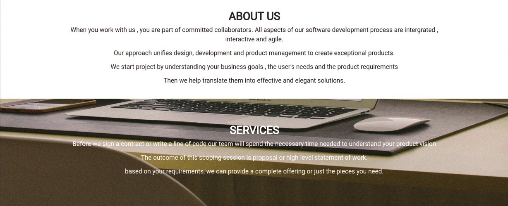
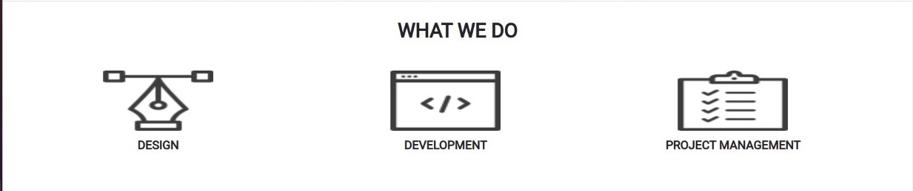
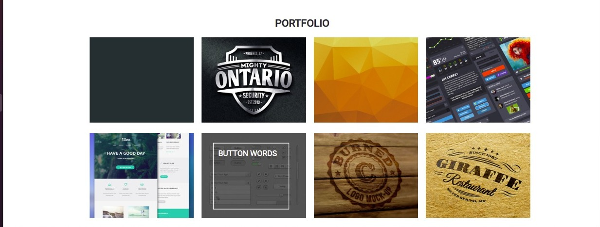
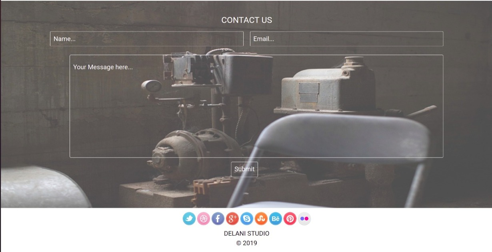

# delani-studio
 Delani studio is a fictional studio that showcases the different activities carried out in the studio.

## Live site 
https://memory-wabwile.github.io/delani-studio/

## Author 
Wabwile Memory
https://github.com/Memory-Wabwile

## Description
 Delani studio is a fictional studio that includes all activities carried out in delani studio including their projects , designs and management. Also has a form to be filled by clients incase they need anything or any queries.

## Design
Landing page design for Delani Studio

 

## Setup/Installation Requirements
* click on https://github.com/Memory-Wabwile/delani-studio.git to clone this repository.
* application runs on all browsers
* This application can run on any software , android , MacOs or windows. it only needs installation which can be done from playstore appstore or any browser

## Known Bugs
currently there are no identified bugs of the system 

## Technologies Used
1.Html - for the front end design 
2.Css - for styling the page 
3.Javascript - for adding functionality 
4.Bootstrap - for responsiveness 
5.Jquery - for functionality 

## Behaviour Driven Development
<ul>
<li>Click on the " what we do" icons to see the description of each.</li> 
<li>Hover around the portfolio images to see the title of the project.<li> 
<li>The user iputs their name , email and message and after clicking on submit button , this details will be saved by delani studios, and the user will receive a pop message informing them if their message has been received.</li> 
</ul><r>

## Contributions
contributors are welcome.. click on  https://github.com/Memory-Wabwile/delani-studio.git and make a pull request then commit the changes

## Support and contact details
Contact me at memorywabwile@gmail.com for any querries or inquiries.

### License
Copyright (c) {2021} *{Wabwile Memory}*

Permission is hereby granted, free of charge, to any person obtaining a copy
of this software and associated documentation files (the "Software"), to deal
in the Software without restriction, including without limitation the rights
to use, copy, modify, merge, publish, distribute, sublicense, and/or sell
copies of the Software, and to permit persons to whom the Software is
furnished to do so, subject to the following conditions:

The above copyright notice and this permission notice shall be included in all
copies or substantial portions of the Software.

THE SOFTWARE IS PROVIDED "AS IS", WITHOUT WARRANTY OF ANY KIND, EXPRESS OR
IMPLIED, INCLUDING BUT NOT LIMITED TO THE WARRANTIES OF MERCHANTABILITY,
FITNESS FOR A PARTICULAR PURPOSE AND NONINFRINGEMENT. IN NO EVENT SHALL THE
AUTHORS OR COPYRIGHT HOLDERS BE LIABLE FOR ANY CLAIM, DAMAGES OR OTHER
LIABILITY, WHETHER IN AN ACTION OF CONTRACT, TORT OR OTHERWISE, ARISING FROM,
OUT OF OR IN CONNECTION WITH THE SOFTWARE OR THE USE OR OTHER DEALINGS IN THE
SOFTWARE.)

